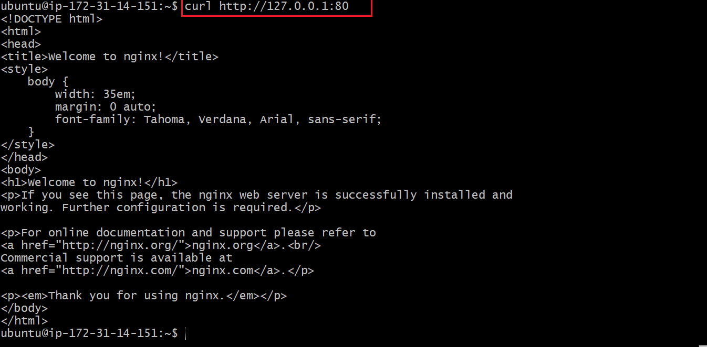
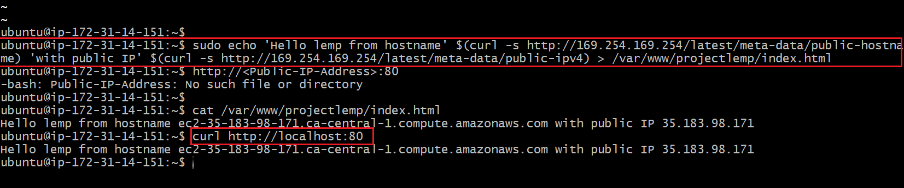
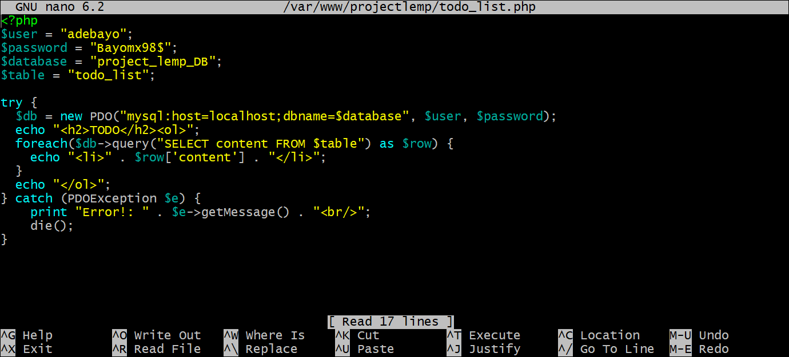

# Deploying a LEMP Stack Application On AWS Cloud
A LEMP Stack application is an application which as opposed to a LAMP Stack Application makes use of Nginx as the web server for hosting the web application. NGINX is an open source software for web serving, reverse proxying, caching, load balancing, media streaming, and more.

## Creating an Ubuntu EC2 Instance
Login to AWS Cloud Service console and create an Ubuntu EC2 instance. The virtual machine is a linux operating system which serves as the backbone for the LEMP Stack web application.


Login into the instance via ssh on git bash
 

## Installing Nginx

Run a `sudo apt update` to download package information from all configured sources. 
and then run `sudo apt install nginx` to intall the the nginx maclhine as shown below.


Run `systemctl status nginx` to check if the installation succeeds. A green text color shows that the server is active as shown below. 

Accessing the default nginx web server block to see if everything works correctly. curl the local IP address of our local machine which in most case is 127.0.0.1 or the DNS name localhost on any web browser on our local machine.
curl http://127.0.0.1:80 or curl http://localhost:80

The below result shows nginx has been properly set up and we can deploy our web application as shown below. 

To gain access to our webserver via the public internet, we need to configure inbound security group rules for ubuntu ec2 instance on aws cloud. Enable TCP port 80 as shown below 

When we insert our public IP address on our browser, the nginx default webpage shows up showing that the webserver is now visible from the internet via the port 80 which was opened as shown below. 

## Installing MySQL
We have succeeded in setting up our nginx webserver and ensured its accessible over the internet. Next is to install mySQL which is a relational database management server to help store data and manage content on our web application. To do this we run `sudo apt install mysql-server` as shown below 
With mysql_server successfully configured, login into the mysql server using `sudo mysql` and exit from the web server we enter `exit`as shown below 

## Installing PHP and its Modules
We use php to dynamically display contents of our webpage to users who make requests to the webserver. Run `sudo apt install php-fpm php-mysql` as shown below 

To serve our webcontent on our webserver, we create a directory for our project inside the `/var/www/` directory using `sudo mkdir /var/www/projectlemp`. To the  change permissions of the projectlemp directory to the current user system we run `sudo chown -R $USER:$USER /var/www/projectlemp` as shown below 

### Creating a configuration for our server block
 we use `sudo nano /etc/nginx/sites-available/projectlemp` to create a configuration for our server block

The following snippets represents the configuration required for our web server block to be functional  

We then link the configuration file to the sites-enabled directory using `sudo ln -s /etc/nginx/sites-available/projectlemp /etc/nginx/sites-enabled` command and to test our configuration for errors we run `sudo nginx -t` as shown below 

We then reload nginx for all configurations to take effect using`sudo reload nginx`and proceed to create an index.html file inside projectlemp directory and write in contents to be accessed over the internet `sudo echo 'Hello LEMP from hostname' $(curl -s http://169.254.169.254/latest/meta-data/public-hostname) 'with public IP' $(curl -s http://169.254.169.254/latest/meta-data/public-ipv4) > /var/www/projectLEMP/index.html` as shown below . 

## Testing PHP with Nginx
To test our Nginx with PHP we have to creat a PHP in the document root by opening a new file called `info.php` within our document root by ruuning `nano /var/www/projectLEMP/info.php` command. and proceed to save the following PHP code that will return information about our server 
```
{
  <?php
phpinfo();

}
```

we can now access the web browser by visiting the domain name or public IP of the EC2 instance set up in our Nginx configuration file, followed by `/info.php` as shown below 

## Retrieving data from MySQL Database with PHP

Login into our mysql-server using `sudo mysql` command. However, because a password has been set on the database we can access the database using `mysql -u root -p` command 

We then proceed to create a new database by running `CREATE DATABASE <db_name>;` we can also see the database by running `show databases;` 

We create a new user and assign user a password using `CREATE USER 'database_user' IDENTIFIED WITH mysql_native_password BY 'db_password'` as shown below 

Grant the user permission over the created database using `GRANT ALL ON 'db_name'.* TO 'database_user'` as shown below 
exit from the mysql-server in which we are currently logged in as root user and then Login into mysql server using the created user using `mysql -u adebayo -p`


We then create a table for the current user inside the project_lemp_DB database and specify content parameters as shown below
```
{
 CREATE TABLE project_lemp_DB.todo_list (item_id INT AUTO_INCREMENT,content VARCHAR(255),PRIMARY KEY(item_id));

}
```


we then Push in contents into the table using `INSERT INTO lemp_db.todo_list(content) VALUES ('enter contents');` 

We can confirm that the data was successfully saved by running `SELECT * FROM project_lemp_DB.todo_list;` and exit by inputing `exit`

Now we create a php file `todo_list.php in /var/www/projectlemp` directory by running `nano /var/www/projectlemp/todo_list.php` and paste the following code 

```
{
 <?php
$user = "adebayo";
$password = "Bayomx98$";
$database = "project_lemp_DB";
$table = "todo_list";

try {
  $db = new PDO("mysql:host=localhost;dbname=$database", $user, $password);
  echo "<h2>TODO</h2><ol>";
  foreach($db->query("SELECT content FROM $table") as $row) {
    echo "<li>" . $row['content'] . "</li>";
  }
  echo "</ol>";
} catch (PDOException $e) {
    print "Error!: " . $e->getMessage() . "<br/>";
    die();
}

}
```

as shown below 

 

we can now access the page on our web browser by visition the domain name or public IP configured on our EC2 instance followed by `/todo_list.php` as shown below 


